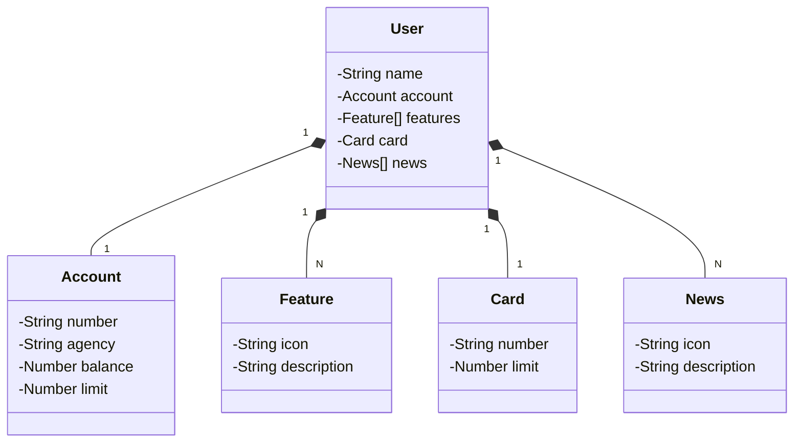

# Bootcamp Santander 2024

**Java RESTful API criada no bootcamp da DIO.**

## Principais Tecnologias
- **Java 17**: Utilizei a versão LTS mais recente do Java para aproveitar as inovações mais recentes dessa linguagem sólida e amplamente usada.

- **Spring Boot 3**: Adotei a versão mais recente do Spring Boot, aumentando minha produtividade por meio de sua autoconfiguração eficiente.

- **Spring Data JPA**: Simplifiquei a camada de acesso aos dados, facilitando a integração com bancos de dados SQL usando Spring Data JPA.

- **OpenAPI (Swagger)**: Desenvolvi uma documentação de API clara e acessível com OpenAPI (Swagger), alinhada à produtividade do Spring Boot.

- **Railway**: Usei o Railway para facilitar o deploy e monitoramento das minhas soluções na nuvem, aproveitando bancos de dados como serviço e pipelines de CI/CD.
## [Link do Figma](https://www.figma.com/file/0ZsjwjsYlYd3timxqMWlbj/SANTANDER---Projeto-Web%2FMobile?type=design&node-id=1421%3A432&mode=design&t=6dPQuerScEQH0zAn-1)

O Figma foi utilizado para a abstração do domínio desta API, sendo útil na análise e projeto da solução.

## Diagrama de Classes (Domínio da API)



## Como Executar

1. **Clone o repositório:**

    ```bash
    git clone https://github.com/gustavocampelo/santander-dev-week-2024.git
    ```

2. **Navegue até o diretório do projeto:**

    ```bash
    cd santander-dev-week-2024
    ```

3. **Execute a aplicação:**

    ```bash
    ./mvnw spring-boot:run
    ```

4. **Acesse a documentação da API:**

   Abra seu navegador e vá para [http://localhost:8080/swagger-ui.html](http://localhost:8080/swagger-ui.html) para visualizar e interagir com a documentação gerada pelo Swagger.
